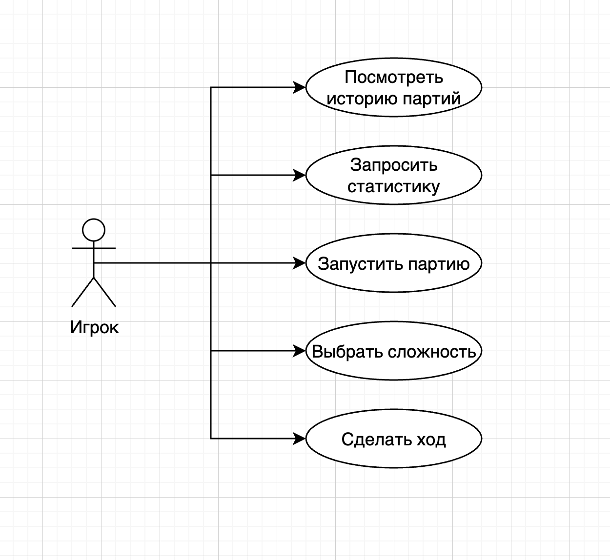
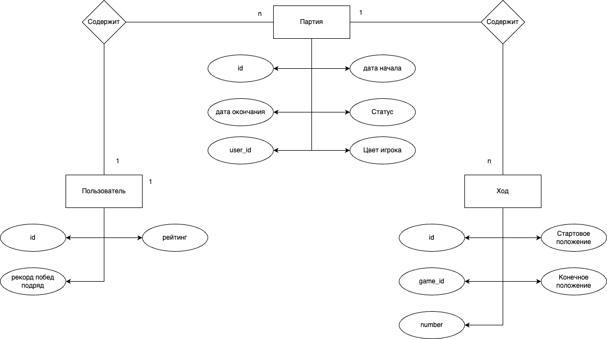

# Идея проекта 
Разработать визуализацию для AI шахмат на реальных досках. Специфика заключается в том, что вторым игроком является AI, который самостоятельно перемещает фигуры на доске в свой ход, а если фигура системы "съедена", то она делает самовыпил (съезжает с доски).

# Краткое описание предметной области
AI шахматы позволяют играть без реального партнера, имитируя действия оппонента с заданной сложностью. Улучшать свои навыки игры.

# Краткий анализ аналогичных решений
smart-chess - предоставляют аналогичный механизм перемещения фигур. 
GoChess - предоставляют подсветку возможных ходов, не предоставляют AI соперника. Передвижение фигур со смещением.

# Краткое обоснование целесообразности и актуальности проекта
Проект может быть адаптирован для реальных AI досок (физических) за счет того, что работает по принципу "получение хода игрока" -> "получение хода AI" -> "высчитывание маршрута" -> "отрисовка перемещения заданной фигуры с исходной позиции на заданную", где вместо последней части, отвечающей за визуализацию, может быть реальная доска, перемещающая фигуры.

# Описание ролей
Пользователь, играющий с AI.

# Use-Case - диаграмма

# ER-диаграмма сущностей

# Пользовательские сценарии

# Специфика перемещения фигур.
Если есть мешающая фигура, отодвигаем ее, выбирая маршрут, при котором придется сдвигать минимум фигур. Когда фигура съедена - агрессор подъзжает, жертва съезжает с доски, агрессор встает на ее позицию. 

